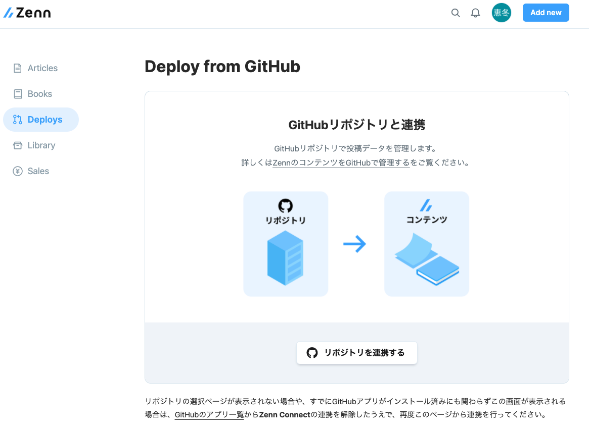
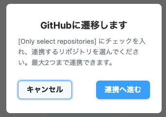
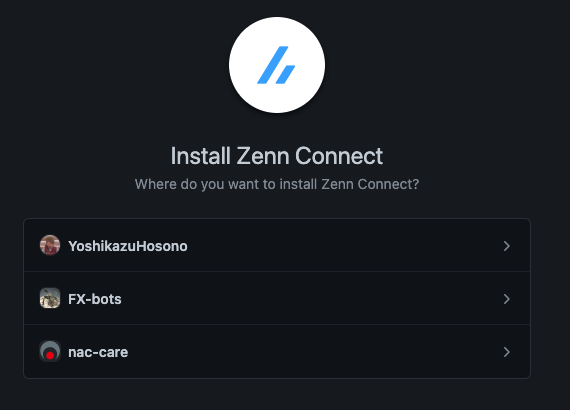
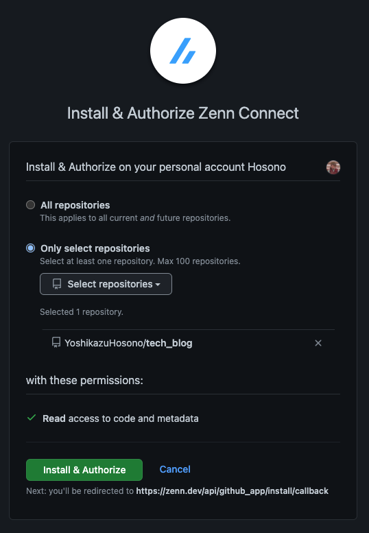
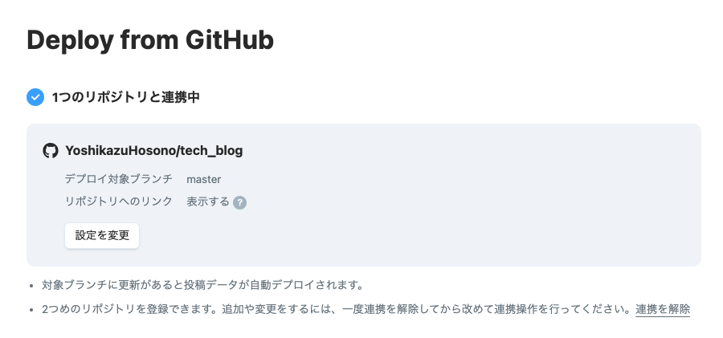

# tech_blog

---

## なにこれ

外部に公開する記事を置いとく場所。

---

## 執筆する環境

ホソノ環境

エディタ

- VSCODE
- VSCODE Plugins
  - Prettier - Code formatter
  - markdownlint

---

## 事前準備

1. github に、記事投稿用のリポジトリを作成

2. このリポジトリを落としてくる

```sh
git clone https://github.com/YoshikazuHosono/tech_blog.git
```

1. 移動して

```sh
cd tech_blog
```

1. リモートが細野環境なので削除

```sh
git remote remove origin
```

1. 自分の remote を設定

```sh
git remote add origin <自分のリポジトリ URL>
```

1. 一回 push しとこ

```sh
git push --set-upstream origin master
```

1. [Zenn](https://zenn.dev/) にアクセス(アカウントなかったら作って)

1. [Zenn : 自動デプロイ設定](https://zenn.dev/dashboard/deploys)にアクセス
   

1. `リポジトリを連携する`ボタンを押して、`連携へ進む`ボタンを押す
   

1. 自分のアカウントを選択
   

1. `only select repository`にチェックし、さっき作った記事投稿用のリポジトリを選択
   

1. `Install & Authorize`ボタンを押して、以下の画面になったら OK
   

---

## 記事を書く流れ

```zsh
# ブランチを切って
git checkout -b feature/post-article

# npm依存をとってくる
npm i

# zennの記事テンプレートを作成
## 記事のスラッグ : idみたいなもん。記事の名前を英語にしたりすればおk
## タイトル : 記事のタイトル
## 記事タイプ : tech(技術記事) or idea(アイデア記事) を指定
## 好きな絵文字 : 好きな絵文字を一つ入れる
npx zenn new:article --slug <記事のスラッグ> --title <タイトル> --type <記事タイプ> --emoji <好きな絵文字>

# マークダウンで記事を書いて
vi articles/<記事のスラッグ>.md

# プレビューを確認しとこ
npx zenn preview

# pushして
git add .
git commit -m "hosono demo article"
git push

# pushしたらGithubactionsのCIが動くので、結果を確認
## UIで確認するならここ : https://github.com/<YourGithubName>/<YourRepositoryName>/actions
gh run list --limit 5

# OKだったらmasterブランチに対してPRを作成
# UIで作るならここ : https://github.com/<YourGithubName>/<YourRepositoryName>/pulls > New pull request
gh pr create --base master --title "post article" --body "post article"

# PR作成時にReviewDocが走るので、エラーが出てないか確認

# 誰かにレビューしてもらう

# マージする

# 記事が投稿される
```
